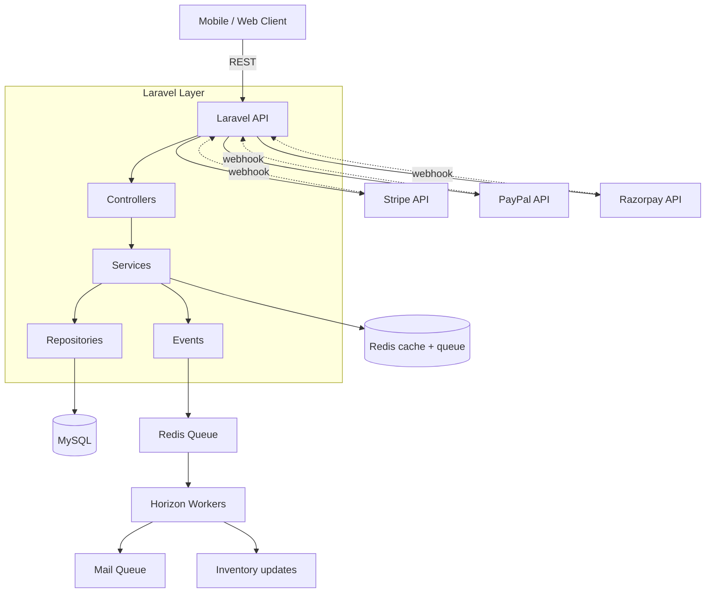

# E-commerce API — Laravel 11 (Flagship)

[](https://github.com/your-username/ecommerce-api-laravel/actions/workflows/ci.yml)


> Replace `your-username` in the badge URLs after you push the repo to GitHub.

A production-grade, scalable e-commerce REST API. Headless by design — bring your own storefront (mobile, React, Vue, Flutter). This is the kind of backend a senior Laravel engineer would ship for a real client.

[Live demo (TODO)](https://example.com) · [Swagger docs](http://localhost:8000/docs/api) · [Postman collection](docs/postman_collection.json)

## What this demonstrates

- **Clean Architecture** — Services + Repositories, no fat controllers
- **Multi-gateway payments** — Stripe, PayPal, Razorpay behind one `PaymentGateway` interface (Strategy pattern), with webhook signature verification and idempotency
- **RBAC** — 4 roles (guest, customer, vendor, admin) with policy-based authorization
- **Catalog** — products, categories, attributes, variants, full-text search
- **Cart engine** — guest -> authenticated cart merge, coupon codes, tax/shipping calculation
- **Order state machine** — `pending -> paid -> fulfilled -> shipped -> delivered` (+ refund path)
- **Atomic inventory** — DB-level row locking on stock decrement (no oversell)
- **Queue workers** — order emails, webhook processing, low-stock alerts via Horizon
- **Redis caching** — tagged cache for product listings with observer-driven invalidation
- **Custom rate limiter** — uses [`umair/redis-rate-limiter`](../redis-rate-limiter) package
- **OpenAPI docs** — auto-generated from controller annotations via Scribe
- **Pest tests** — feature tests for every endpoint, unit tests for services

## Architecture



## Module map

| Module       | Path                                                 |
|--------------|------------------------------------------------------|
| Auth & RBAC  | `app/Http/Controllers/Api/Auth/`                     |
| Catalog      | `app/Domain/Catalog/`                                |
| Cart         | `app/Domain/Cart/`                                   |
| Checkout     | `app/Domain/Checkout/`                               |
| Payments     | `app/Domain/Payment/Gateways/` (Strategy interface)  |
| Orders       | `app/Domain/Order/`                                  |
| Webhooks     | `app/Http/Controllers/Api/WebhookController.php`     |

## Tech stack

- Laravel 11, PHP 8.3
- MySQL 8 (primary) + Redis 7 (cache + queue + sessions)
- Laravel Sanctum (token auth)
- Spatie Laravel Permission (RBAC)
- Laravel Horizon (queue dashboard)
- Stripe PHP SDK, PayPal REST SDK, Razorpay PHP SDK
- Scribe (OpenAPI generation)
- Pest 3 (tests)

## Quick start

```bash
git clone <repo>
cd ecommerce-api-laravel
cp .env.example .env
docker compose up -d
docker compose exec app composer install
docker compose exec app php artisan key:generate
docker compose exec app php artisan migrate --seed
# API: http://localhost:8000
# Swagger: http://localhost:8000/docs/api
# Horizon: http://localhost:8000/horizon
```

Seed creates:
- 1000 products across 12 categories
- Admin: admin@shop.test / password
- Customer: customer@shop.test / password
- Sample coupons: `WELCOME10`, `FREESHIP`

## Key API endpoints

| Method | Path                                   | Role        | Notes |
|--------|----------------------------------------|-------------|-------|
| GET    | `/api/products`                        | public      | Cached, filterable; returns `ProductResource` |
| GET    | `/api/products/{slug}`                 | public      | |
| GET    | `/api/metrics`                         | public      | Prometheus text exposition |
| POST   | `/api/cart/items`                      | customer    | |
| POST   | `/api/checkout`                        | customer    | Accepts `Idempotency-Key`; rate-limited 10/min |
| POST   | `/api/webhooks/{gateway}`              | gateway     | Signature-verified, de-duplicated |
| GET    | `/api/orders`                          | customer    | Returns `OrderResource` |
| GET    | `/api/admin/orders`                    | admin       | |
| POST   | `/api/admin/orders/{order}/transition` | admin       | State-machine guarded |
| POST   | `/api/admin/orders/{order}/refund`     | admin       | Full/partial gateway refund + restock |

Full list in [Swagger](http://localhost:8000/docs/api).

### Idempotent checkout

`POST /api/checkout` accepts an `Idempotency-Key` header. The first request is
processed and its response cached in Redis for 24h; any retry with the same key
replays the stored response (header `Idempotent-Replayed: true`) instead of
creating a second order or double-charging the customer.

## Key implementation highlights

- **Strategy-based gateways** — [app/Domain/Payment/Gateways/PaymentGateway.php](app/Domain/Payment/Gateways/PaymentGateway.php) + implementations (Stripe/PayPal/Razorpay) so adding a new gateway is one class
- **Idempotent checkout** — [app/Http/Middleware/IdempotencyKey.php](app/Http/Middleware/IdempotencyKey.php) replays cached responses for repeated `Idempotency-Key`s with a Redis lock to guard concurrent duplicates
- **Idempotent webhooks** — see `WebhookController::handle()` (idempotency key checked in Redis before processing)
- **Gateway refunds** — `OrderService::refund()` issues full/partial refunds through the same `PaymentGateway` interface and restocks on full refund
- **Atomic stock decrement** — `OrderService::reserveStock()` uses `lockForUpdate()` in a transaction
- **Cache invalidation** — `ProductObserver` flushes tagged Redis cache on save/delete
- **Custom rate limiter** — the sibling [`umair/redis-rate-limiter`](../redis-rate-limiter) package (sliding window) guards checkout via the `rate.limit` middleware
- **Stable API contracts** — `ProductResource` / `OrderResource` decouple the JSON shape from Eloquent models
- **Observability** — `X-Request-Id` on every request, structured JSON logs, and `/api/metrics`

## Tests

```bash
docker compose exec app ./vendor/bin/pest
docker compose exec app ./vendor/bin/pest --coverage
```

## Roadmap / known limitations

- Search uses MySQL full-text; switch to Meilisearch/Typesense for production scale
- No multi-currency yet (single base currency)
- Email templates are unstyled HTML; production should use MJML or React Email
- Refunds are gateway-mediated (full + partial supported via API); no admin refund UI yet

## Deploy

See [DEPLOY.md](DEPLOY.md) for Railway + managed MySQL + managed Redis setup.

<!-- ownership:author -->
---

## Author

**Umair** &mdash; [@umairjutt](https://github.com/umairjutt)

Designed, built and maintained by me. Licensed under the [MIT License](LICENSE).